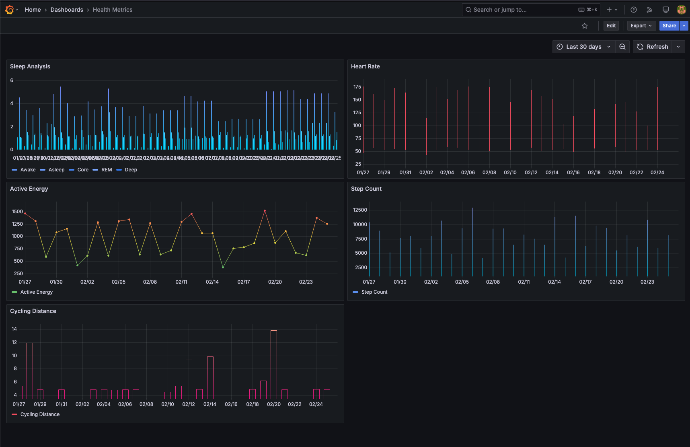

# Health Auto Export

## Overview

This project provides a web interface for viewing Apple Health data via a web interface using Grafana and a Node.js server.

This project aims to be as beginner-friendly as possible, so if you're just getting started with programming, or consider yourself a "non-technical" person, this is a safe space! Of course, this also serves as a great base for the more seasoned developers to build on.

## Requirements

In order to use this project, you will need:

1. The [Health Auto Export](https://apple.co/3iqbU2d) app for iPhone
2. [Docker Desktop](https://www.docker.com/products/docker-desktop/) installed on your computer

## Setup Guide

### Step 1: Computer Setup

1. Download and install Docker Desktop for your platform [here](https://www.docker.com/products/docker-desktop/)
2. Clone or download this repository to your desired location on your computer
3. Open a terminal/command prompt in the project folder
4. Run `sh ./create-env.sh` to create the `.env` file, or create the file manually with the following variables:
   - `NODE_ENV`: `production`
   - `MONGO_HOST`: `hae-mongo`
   - `MONGO_USERNAME`: `admin`
   - `MONGO_PASSWORD`: `mypassword` (set a secure password)
   - `MONGO_DB`: `health-auto-export`
   - `MONGO_PORT`: `27017`
5. Run `docker compose up -d` in your terminal
6. Open Grafana in your browser at http://localhost:3000
7. Login with the default credentials: `admin / admin`
8. Determine [your computer's local IP address](https://geekflare.com/consumer-tech/find-ip-address-of-windows-linux-mac-and-website/) and note it down
9. Configure the Health Auto Export app to send data to http://your-computer-ip:3001/api/health-data as outlined in **Step 3**

### Step 2: Grafana Setup

1. Configure the Grafana data source by selecting `Administration` in the left sidebar, then search for `Infinity`
2. Select and install `Infinity` plugin. After installation, select `Add new data source`
3. Give the data source a name, for example `Health Auto Export`
4. In the `URL, Headers & Params` section, set the `Base URL` to `http://host.docker.internal:3001`
5. Select `Save & test` to complete the data source setup
6. This data source can now be used to create dashboards using the synced data

### Step 3: iPhone Setup

1. Install and open the [Health Auto Export](https://apple.co/3iqbU2d) app on your iPhone
2. Navigate to the `Automations` tab
3. Create a new automation
4. Configure the automation with the following settings:
   - Automation Type: `REST API`
   - URL: `http://your-computer-ip:3001/api/data`
   - Data Type: `Health Metrics` or `Workouts` (create separate automations for each if you want to sync different data types)
   - Export Format: `JSON`
   - Aggregate Data: `Enabled` 🟢
   - Aggregate Interval: `Days`
   - Batch Requests: `Enabled` 🟢
5. Tap `Update` in the top navigation bar to save the automation
6. Use `Manual Export` to select a date range and manually trigger a data export to your computer

### Step 4: Viewing Data

1. Open Grafana in your browser at http://localhost:3000
2. Create a new dashboard or import a pre-configured dashboard as described in **Step 5**

### Step 5: Import Dashboards (Optional)

If you are unfamiliar with Grafana, you can import pre-configured dashboards to get started quickly.

1. Navigate to the `Dashboards` tab
2. Select `New` and then `Import`
3. Upload the dashboard JSON file from the `dashboard-examples` folder, or copy the JSON into the `Import via dashboard JSON model` text area

# Troubleshooting

If you encounter issues:

1. You can use [ChatGPT](https://chatgpt.com/) or [Claude](https://claude.ai/) to help you troubleshoot or fix specific errors
2. Ensure Docker is running
3. If you're still stuck, feel free to reach out using the support options below.

## Support

If you need assistance:

- Open an issue on GitHub
- Join the [Discord server](https://discord.gg/PY7urEVDnj)
- Contact [support](https://healthyapps.dev/contact)

## Contributing

Your contributions are welcome! Whether it's a bug fix, a new feature, a documentation update, or sharing your dashboards, we appreciate your help.

If you'd like to contribute to this project, create a pull request with your changes.
